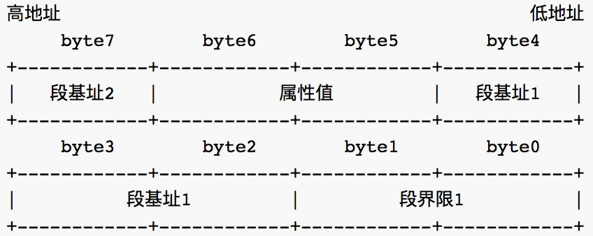
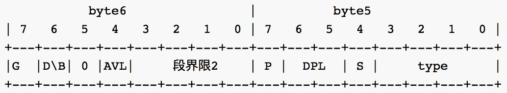
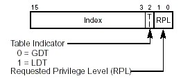
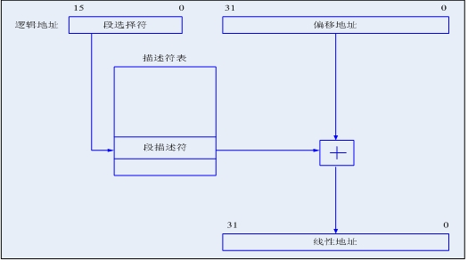
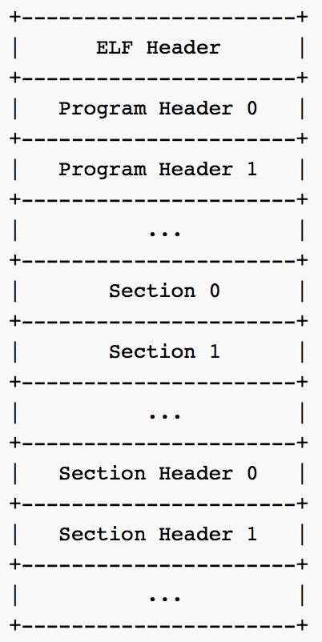
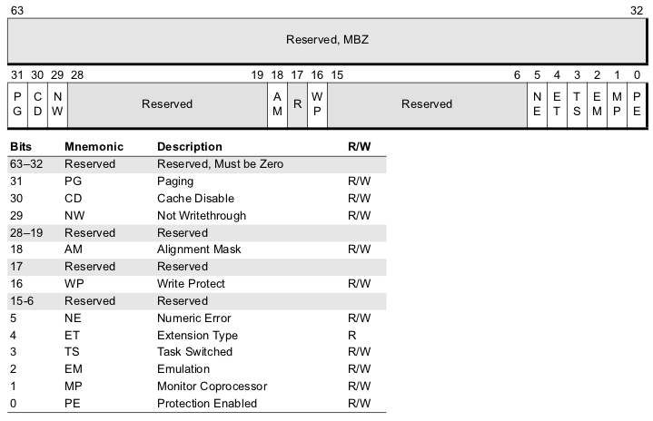

#Lab1 系统引导	
------
[◀◀回到首页](main.html)

<b>重要通知</b>

<li>Lab1 deadline 延期至3月20日</li>
<li>15日之前提交的同学将获得一定加分, 提交以网站时间为准.</li>

**实验提交(请认真阅读以下内容, 若有违反, 后果自负)**

* <u>截止时间:**<strike>2016/3/14 23:59:59</strike> 2016/3/20 23:59:59** (如无特殊原因, 迟交的作业将损失50%的成绩(即使迟了1秒), 一般而言, 截止日期后7天未提交者即视为没有提交, 请大家合理分配时间,)</u>
* **请大家在提交的实验报告中注明你的邮箱, 方便我们及时给你一些反馈信息.同时，如果你有任何问题请发邮件到<u style="color:red;">wyj@smail.nju.edu.cn</u>**
* **学术诚信**: 如果你确实无法完成实验, 你可以选择不提交, 作为学术诚信的奖励, 你将会获得10%的分数; 但若发现抄袭现象, 抄袭双方(或团体)在本次实验中得0分, 且discount factor翻倍. 
* **提交方式**: 为了尽可能避免拖延症影响实验进度, 我们采用分阶段方式进行提交, 你需要在每个阶段结束前提交相应的实验内容, 否则将会损失相应的分数.
* <u>请你在实验截止前务必确认你提交的内容符合要求(格式, 相关内容等), 你可以下载你提交的内容进行确认. 如果由于你的原因给我们造成了不必要的麻烦, 视情况而定, 在本次实验中你将会被扣除一定的分数, 最高可达50%.</u>

<b>报告提交规范(请认真阅读以下内容, 若有违反, 后果自负)</b>

<li>提交的文件打成一个压缩包(zip)。压缩包中包含lab与report两个子文件</li>
<li>压缩包的命名形式为"lab1-学号姓名.zip"，以及对实验的简要说明</li>
<li>/lab中存放最终版本的源代码。只包含最终版本，且需包括编译脚本、所有源文件，但不应该包括任何二进制文件（即打包之前make clean一下）。</li>
<li>/report中存放实验报告。报告统一格式为“lab1-学号姓名.pdf”,请在你的报告中注明你的邮箱，以便能够在你的报告有问题时可联系到你</li>

###目录
1. [实验要求](#toc_3)
2. [相关资料](#toc_7)
3. [解决思路](#toc_11)
4. [框架代码](#toc_16)
5. [代码调试](#toc_17)
5. [实验提交](#toc_18)

##Lab1 系统引导
========

实验讲义下载: [Lab1](lab1/Lab1.pptx)

###1. 实验要求
本实验通过实现一个简单的引导程序,让你了解系统的启动过程和程序运行的基本过程。在理解系统启动过程的基础之上实现以下内容

####1.1. 实现一个简单的引导程序
实现一个简单的引导程序,用`qemu`运行后在屏幕上打印出字符串后无限循环

**`Boot: Hello, world!`**

要求用汇编代码实现, 当然在打印出这段文字之前, 你需要完成从`实模式`到`保护模式`的切换, 如此你就不可以使用BIOS中断而采用直接对内存进行修改来完成字符串的打印, 为此你需要知道对应显存所在内存地址.

> 如果你还不熟悉AT&T汇编语法, 可以在下载这个[PPT](lab1/AT&T汇编语法.ppt)进行学习

####1.2. 将磁盘中的程序写入到内存的相应位置并运行
进一步扩展引导程序，尝试加载一个存放在0号扇区以外的程序片段，并执行它，执行完成后，返回引导程序。你需要在引导程序中实现将磁盘上的用户程序(ELF文件格式)拷贝到内存中的功能，并跳转到内存的相应位置执行这一段代码(这里你需要用c语言实现)，具体内容如下：

引导程序主要步骤：
1. 打印**`Loading…`**
2. 读磁盘1号扇区，根据 ELF 文件头的内容加载程序到内存相应位置。
3. 打印**`Execute…`**
4. 跳转到程序入口地址，调用加载完成的程序片段
5. 程序片段结束后(执行`ret`)之后，打印**`Back to Boot`**，之后无限循环

程序片段的主要步骤:

1. 打印**`Process: Hello world!`**
2. `ret`

这里要求用 C 语言和汇编共同完成

<b>提示</b>

实际操作过程中, 你可能会发现512字节的引导程序并不允许你书写大量的字符串输出代码, 所以你可以尽自己所能输出重要的字符串, 输出方法不限. 

尝试修改你的程序片段,在打印`Process: Hello world!`后, 附加一些只要求输出的应用比如计算 $\pi$ 小数点后 $n$ 位内容, 为了做到这一点, 你需要自己定义一个自定义的 `print` 函数. 应用内容不限, 任君挑选.

###2. 相关资料
> 本章资料部分取自于jyy大神的操作系统实验课教程, 秉承着前人载树, 后人乘凉的原则, 我就毫不要脸地拿过来用了

###2.1. IA-32存储管理
在IA-32下, CPU有两种工作模式: 实模式和保护模式. 直观得看, 我们打开自己的PC后, 开始时CPU是工作在实模式下的, 经过某种机制后, 才进入保护模式. 在保护模式下, CPU有着巨大的寻址能力, 并为强大的32位操作系统提供了更好的硬件保障. 我们可以如此类比一下, 实模式到保护模式的切换就好比于政权的更替. 开机时在实模式下, 就好像是皇帝A执政, 他有他的一套政策, 如果你不按照他的政策执行, 就会被砍头, 后来发生了革命, 新皇帝B登基了, 登基后, 皇帝B颁布了新政策也就是保护模式, 当然新政策肯定要比旧政策来得好.

那这两套政策有什么不同呢, 我们回忆一下旧政策产生于8086时代, 那时候的CPU是16位的, 它有16位的寄存器(Register), 16位的数据总线(Data Bus)和20位的地址总线(Address Bus)和1MB的寻址能力(思考一下,为什么是1M?). 一个地址有段和偏移两部分组成, 物理地址遵循这样的计算公式:
	
	物理地址(Physical Address) = 段值(Segment) << 4 + 偏移(Offset)

段值和偏移都是16位.

80286开始有虚拟保护模式, 并拥有24位地址线, 80386开始, Intel处理器步入32位CPU时代. 80386有32位地址线, 所以寻址空间有$2^{32}$B=4GB. 但是Intel为了向下兼容在开机时仍旧保留了实模式的运行方式, 对于80386来说, 这也是只是一瞬的事情, 开机后, 会立马从实模式完成向保护模式的跳转.

在实模式下, 16位寄存器需要用"段:偏移"这种方法才能达到1MB的寻址能力, 如今有了32位寄存器, 一个寄存器就可以寻址4GB的空间, 那是不是从此段值就被抛弃了呢? 实际上, 皇帝B的新政策下仍旧用"段:偏移"来表示, 只不过在新政策下, "段"的概念发生了根本性的变化. 实模式下, 段值可以看做是地址的一部分, 而保护模式下, 虽然段值仍然由原来的16位寄存器表示, 但是它此时变成了一个索引, 这个索引指向一个**数据结构**的一个表项, 表项中定义了段的起始地址,界限,属性等内容. 这个数据结构, 就是**GDT(Global Descriptor Table)**, GDT中的一个表项就叫做描述符(Descriptor)

**GDT全局描述符表**

也就是说, GDT的作用是用来提供段式存储机制, 这种机制是通过段寄存器和GDT中的描述符共同提供的. 为了全面了解它, 我们看一下图中所示的代码段和数据段描述符, 除此之外, 还有系统段描述符和门描述符, 这部分内容先不作介绍.

	
下图是描述符中的属性值(第5, 6个byte)内容

	

<b>LDT局部描述符表</b>

很多同学看到这里可能会问: LDT呢? 
在你实现的操作系统中, 并不要求每个程序都拥有一个自己的局部描述符表, 而是所有程序共享同一个全局描述符表

**GDTR**

为了进入保护模式, 我们需要在内存中开辟一块空间存放GDT表, Intel的设计者门提供了一个寄存器`GDTR`用来存放GDT的入口地址，程序员将GDT设定在内存中某个位置之后，可以通过`LGDT`指令将GDT的入口地址装入此寄存器. GDTR中存放的是GDT在内存中的基地址以及其表长界限:
	
	

**段选择子**

由GDTR访问全局描述符是由段选择子(实模式下的16位段寄存器)来完成的, 为了访问一个段, 处理器将这个段的选择子装入机器的6个段寄存器中, 比如代码段装入CS, 数据段装入DS. 

段选择子, 顾名思义就是相应段的基地址, 但是却稍有不同, 它是一个稍复杂的数据结构:

TI位指出这个段是局部段还是全局段, PRL指出了选择自的特权等级(共四个特权等级, 数字越小, 特权越高), 13位Index是表项在描述符表里的编号, 可以看做是所选段相对于描述符表基地址的偏移.

<b>实模式与保护模式的寻址空间</b>

看完以上内容, 来思考一个问题, 保护模式下32位的寄存器的寻址空间就有4GB, 那使用<code>段选择子:偏移</code>这样的寻址方式最大寻址空间能达到多大呢?给出计算的过程吗?

因此, 实模式与保护模式在寻址上的区别就在于, 实模式是采用`段基地址:偏移量`的逻辑地址, 而保护模式则是采用的`段选择子:偏移量`作为逻辑地址.

**地址运算**

于是我们为了访问一个内存地址给出了一个段选择子和一个偏移量, 逻辑地址表示如下:
	
	segmentSelector:Offset

根据如下规则, 我们将从逻辑地址转换到线性地址, 如果不启用分页, 那么这就是最终的物理地址了.

###2.2. ELF文件格式

在第二部分的实验中, 我们需要将磁盘第二个扇区中的用户程序(ELF文件格式保存)加载到内存的相应位置, 所以我们需要先搞清楚 ELF 文件的结构.

**ELF 格式**

ELF(Executable and Linking Format)是一种对象文件格式(Object files), 而这里的对象文件格式又包括三种

* 可重定位的对象文件(Relocatable file)--.o 文件
* 可执行的对象文件(Executable file)
* 可被共享的对象文件(Shared object file)--.so 动态库文件

你用 `make` 所产生的 \*.o/\*.so/test 等文件都是 ELF 对象文件, 如果想要知道都属于哪类文件, 可以使用 file 命令查看

	[test@linux]$ file test.o test.so test
	test.o:     ELF 32-bit LSB relocatable, Intel 80386, version 1 (SYSV), not stripped
	test.so:	ELF 32-bit LSB shared object, Intel 80386, version 1 (SYSV), not stripped 
	test:		ELF 32-bit LSB executable, Intel 80386, version 1 (SYSV), for GNU/Linux 2.2.5, dynamically linked (uses shared libs), not stripped

其实以上内容都是我瞎编的, 你可以自己亲自尝试一下, 到底一个 ELF 对象文件哪类. 

**ELF 头结构**

ELF 文件由4部分组成, 分别为ELF 头(ELF Header), 程序头(Program Header Table), 节(Section)和节头(Section Header Table). 虽然不是每个 ELF 文件都包含这4部分内容, 但是 ELF 头的位置是固定的, 也是由 ELF 头中的数据来决定其他部分的组成. 下面是一张通用的 ELF 文件结构图

可以看到 ELF 头出现在最前面, 而其他部分的长度都是可变的, 只有 ELF 是固定的. 我们给出 ELF 头的结构

	struct ELFHeader {
		unsigned int   magic;
		unsigned char  elf[12];
		unsigned short type;
		unsigned short machine;
		unsigned int   version;
		unsigned int   entry;		//程序入口
		unsigned int   phoff;		//Program Header 偏移
		unsigned int   shoff;		//Section Header 偏移
		unsigned int   flags;
		unsigned short ehsize;		//此头长度
		unsigned short phentsize;	//程序头长度
		unsigned short phnum;		//程序头数
		unsigned short shentsize;	//节头长度
		unsigned short shnum;		//节头数
		unsigned short shstrndx;
	};
	
我们通过一个例子来理解一个结构的内容, 我们用 GNU binutils 的readelf 工具查看一个 .o 文件的ELF 头内容

	[test@linux test]$ readelf -h ./test.0
	ELF Header:
	  Magic:   7f 45 4c 46 01 01 01 00 00 00 00 00 00 00 00 00 
	  Class:                             ELF32
	  Data:                              2's complement, little endian
	  Version:                           1 (current)
	  OS/ABI:                            UNIX - System V
	  ABI Version:                       0
	  Type:                              REL (Relocatable file)
	  Machine:                           Intel 80386
	  Version:                           0x1
	  Entry point address:               0x0
	  Start of program headers:          0 (bytes into file)
	  Start of section headers:          184 (bytes into file)
	  Flags:                             0x0
	  Size of this header:               52 (bytes)
	  Size of program headers:           0 (bytes)
	  Number of program headers:         0
	  Size of section headers:           40 (bytes)
	  Number of section headers:         9
	  Section header string table index: 6
	
ELF 的开头四个字节(也就是结构中的 magic 和 12比特的 elf), 是机器无关的固定内容, 包括 `magic=`0x7f 以及三个EFL 字符.

**程序头结构**

在 ELF 头中提到的Program Header 头的结构如下所示:

	struct ProgramHeader {
		unsigned int type;
		unsigned int off;		//这个段第一个字节在文件中的偏移
		unsigned int vaddr;		//这个段第一个字节在内存中的虚拟地址
		unsigned int paddr;		//应当加载到的物理内存地址
		unsigned int filesz;	//这个段在 elf 文件中的长度
		unsigned int memsz;		//这个段在内存中的长度
		unsigned int flags;
		unsigned int align;
	};
	
程序头描述的是这个段在文件中的位置和大小以及在内存中的位置和大小.
	
###2.3. 系统启动

在按下开机按钮到你看到操作系统桌面的时间里, 计算机究竟做了些什么呢? 实际上, Linux, Windows等现代操作系统已经做了大量初始化工作. 为了方便我们揭开"启动"这一层神秘的面纱, 我们采用jyy大神的精明扼要的启动方式。

计算机加电后, 一些寄存器会被设置初值, 计算机将运行在`实模式`(real-address mode)下, 其中CS:IP指向BIOS的第一条指令, 即首先取得控制权的是BIOS. BIOS将检查各部分硬件是否正常工作, 然后按照CMOS RAM中设置的启动设备查找顺序, 来寻找可启动设备.

<b>一些疑问</b>

<li>什么是实模式? 什么是保护模式? (什么? 你已经忘掉了? 我们已经在IA-32存储管理的讲义中提到这些内容了, 快去复习!)</li>
<li>保护模式比实模式更"先进", 为什么计算机加电后不直接运行在保护模式下呢?</li>
<li>内存是易丢失性的存储介质, 开机的时候内存应该没有任何有效数据, 为什么说加电后CS:IP指向BIOS的第一条指令呢?</li>

启动设备首扇区(第1扇区, 大小为512字节)的地位比其它任何扇区都重要, 它含有肩负着启动任务的代码, 因此人们也称它为MBR(master boot record). 但并不是所有设备都是可以启动的, 想象一下计算机把一只普通U盘首扇区中的数据当作启动代码来执行, 将会导致计算机进入异常状态. 因此必须有一种机制来区分可启动设备和不可启动设备. 区分的方法是使用`魔数`(magic number): 在一个合法的MBR中, 末尾的两个字节一定是`0x55`和`0xaa`.

**查看磁盘的MBR**
> 在Linux中, 你可以很容易地查看磁盘的MBR(需要root权限):
> 
> <pre><code>head -c 512 /dev/sda1 | hd</code></pre>
> 
> 你可以在输出结果的末尾看到魔数`0x55`和`0xaa`.

有了这个魔数, BIOS就可以很容易找到可启动设备了: BIOS依次将设备的首扇区加载到内存`0x7c00`的位置, 然后检查末尾两个字节是否为`0x55`和`0xaa`. `0x7c00`这个内存位置是BIOS约定的, 如果你希望知道为什么采用`0x7c00`, 而不是其他位置, [这里](http://www.glamenv-septzen.net/en/view/6)可以给你提供一些线索. 如果成功找到了魔数, BIOS将会跳到`0x7c00`的内存位置, 执行刚刚加载的启动代码, 这时BIOS已经完成了它的使命, 剩下的启动任务就交给MBR了; 如果没有检查到魔数, BIOS将会尝试下一个设备; 如果所有的设备都不是可启动的, BIOS将会发出它的抱怨: "找不到启动设备".

在Lab1中, 你需要实现一个MBR, 也就是我们的引导程序. 请记住, 我们现在仍然处在实模式下. 引导程序第一件事要屏蔽所有中断, 之后将段寄存器清零, 并打开A20地址线, 加载GDT的基地址, 切换到保护模式, 跳转到32位代码. 在32位代码中, 引导程序重新设置保护模式下的段寄存器, 然后设置栈顶指针(例:`0x8000`, 这是随手设置的), 然后将跳转到 C 代码.

C代码的任务是将磁盘中的程序片段加载到内存中并跳转到相应位置运行, 程序先读入磁盘第二块扇区往后的扇区内容, 然后根据 ELF 头文件的内容将我们的程序代码加载到内存的相应位置. 最后通过ELF 的程序入口地址跳转到相应内存执行相应代码.

 
###3. 解决思路
####3.1. 引导程序与“Hello,沃德!”
大家在刚开始学习自己的第一门编程语言的时候, 应该不会忘记自己的第一个程序应该就是"hello, world!", 作为所有编程语言的起始阶段，它占据着无法改变的地位, 在完成操作系统实验课程的第一步时, 同样也要从这里开始.

还记得第一次学习c语言程序的时候的代码吗?

	#include "stdio.h"
	void main()
	{
		printf("Hello World!");
		return 0;
	}
当你运行这一段代码, 在屏幕上看到`Hello World!`的时候心里是不是特别激动, 那现在, 我们先让我们的操作系统也和这个世界打个招呼吧

		movw	$hello, %ax
		movw	%ax, %bp
		movw	$13, %cx		#输出的字符串长度
		movw	$0x1301, %ax	#AH=0x13 在Teletype模式下显示字符串
								#AL=0x01 输出方式
		movw	$0x000c, %bx	#BH=0x00 黑底, BL=0x0c 红字
		movw	$0x0000, %dx	#输出坐标 行0,列0
		int		$0x10			#BIOS中断 显示服务
	.loop:
		jmp		.loop
		
	hello:		.string "Hello, World!"		#字符串内容

关于参数以及功能可以查看[BIOS中断表](lab1/BIOS中断表.xlsx)

<b>思考</b>

将上面这段代码拷贝到我们的框架代码里后运行, 发现我们的屏幕输出了一行红色的"Hello world!", 但是此外我们还可能看到一些其他的文字, 有没有办法让屏幕中的其他内容消失呢?

####3.2. 实模式与保护模式

我们刚才完成了实模式下的Helloworld程序, 但这只是我们迈出的一小步. 看完上面的资料后你应该了解了操作系统在加电后所进行的一系列工作, 你的任务就是让你的操作系统来完成这些工作. 首先, 你需要让你的操作系统完成从实模式到保护模式的切换. 为了完成这一步, 你需要:

1. 定义GDT的数据结构
2. 关中断
3. 打开A20地址线
4. 	加载gdt描述符
5. 	置cr0的PE位为1
6. 长跳转进入保护模式

<b>思考</b>

<li>为什么要关中断?</li>
<li>试想一下如果我们没有打开A20地址线, 在保护模式下会出现什么问题?(这也算是一个历史遗留问题)</li>
<li>cr0是什么?为什么要置PE位为1?</li>

在这里, 我们要求你在GDT中定义三个表项, 他们分别是代码段描述符, 数据段描述符和视频段描述符, 代码段和数据段描述符的基地址都为**`0x0`**, 视频段描述符的基地址为**`0xB8000`**(有人会问为什么不是0xA0000?有人能回答吗?). 代码段的属性type为`0x0A`, 数据段和视频段的属性type为`0x02`.

CR0寄存器的结构如下图所示:

CR0的PE位(protection enable)即保护位表示是否开启了段级保护, 一旦置为1, 就表示开启了保护模式, 而开机加电时默认是置为0的. 同理如果要开启分页机制, 就需要把PG位, 即分页标志位置为1, 此次不要求分页, 对CR0寄存器感兴趣的同学可以课后深入探索.

完成以上步骤后便进入了保护模式, 事实上, 操作系统在实模式下运行只发生在开机加点后的一小段时间, 在跳转到保护模式后, 就再也不会返回到实模式了. 在实模式与保护模式下, 你都需要设置正确的段寄存器. 然后你发现在保护模式下没法使用BIOS中断来输出字符, 而BIOS中断的原理其实是通过"封装"系统接口以方便程序员使用, 于是你想到通过写显存的方式让我们的操作系统向这个世界say Hello!(原谅我词穷而说出这么个没有什么因果关系的话)

下面是一段利用视频段寄存器写显存输出字符'H'的例子, 假设`gs`段寄存器是视频段选择子:

	movl	$((80 * 5 + 0) * 2), %edi	#写在屏幕的第5行第0列
	movb	$0x0c, %ah					#0x0黑底,0xc红字
	movb	$72, %al					#72是字母"H"的ASCII码
	movw	$ax, %gs:(%edi)				#写入显存

`%gs:(%edi)`是"段:偏移"的书写格式, 它从视频段描述符中读取的视频段的基地址,加上偏移量来访问内存的相应位置. 好了, 说到这里我想你可以就完成我们的hello world程序了.

<b>提示</b>

<li>我们发现输出一个简单的字符 H 需要如此冗长的代码, 而MBR 引导的大小仅为512字节, 所以我们需要将这个字符打印包装成一个方法方便自己调用, 从而也可以节省代码空间. </li>
<li>如果你想要完成额外的实验内容, 你也需要实现一个自定义的 <code>print</code> 函数</li>
<li>我们要求第二部分的实验用 c 语言实验, 那么如何使用 c 语言实现字符串的现实呢?方法有两种, 第一种方法可以查看<a href="lab1/AT&T汇编语言.ppt">AT&T 汇编语法</a>, 第二种方法就是 C 语言的地址操作.</li>

####3.3. 第一个操作系统也是"hello, world!"
在做完第一部分的实验后, 你发现自己只不过是完成了一个引导扇区的内容, 离一个真正的操作系统还有非常遥远的距离, 但是它是不依赖于任何其他软件, 直接在裸机上运行的, 它与你平时所编写的程序或软件有着本质的区别, 它虽然不是个操作系统, 但已经具备了操作系统的一个特性.

第二部分的实验要求你完成的引导程序基础上, 将磁盘2号扇区的程序(也就是你的第一个操作系统 OS)加载到内存的相应地址中, 并跳转运行(**从保护模式跳转**). 至于加载到内存的哪个地址, 其实有很多选择, 在上文中我们提到可以加载到内存的`0x8000`位置, 当然你也可以选择其他位置. 我们提供两种数据读取方式供你选择:

* 调用BIOS中断的磁盘服务(`0x13`中断)
* 调用`in`,`out`指令读写磁盘和内存

<b>提示</b>

假设你的程序很庞大, 已经超过了512字节, 那么你也可以指定将多个扇区加载到内存中

但是, 不管你选择何种方式, 你都需要对加载到内存的 ELF 文件进行解析(你可以尝试加载后直接跳转到地址运行, 由于我们采用了 ELF 文件格式作为磁盘文件而非二进制可执行文件, 跳转后并不会执行相应的代码). 那么如何解析 ELF 文件呢?在这次实验中, 你需要通过解析 ELF 文件的 ELF 头将代码读入到内存的相应位置. 我们已经在[框架代码](#toc_16)里帮你定义了ELF 头和程序头的数据结构以及三个磁盘和内存操作接口, 请善加利用.

假设你通过解析 ELF 头发现该 ELF 文件包含两个程序头, 那么, 你就应该根据ELF 头中程序头偏移来找到这两个程序头的内容, 再次解析这两个程序头的内容将其所指的代码加载到相应的物理内存地址上, 最后根据 ELF 头中程序的入口地址跳转运行.

<b>思考</b>

你加载的程序片段该如何返回MBR呢?

由于 CPU 的运算速度极快于磁盘的读写速度, 所以在你完成对磁盘的读写任务之前, 一定不要着急做其他事情. 我们在框架代码中为你提供了磁盘了读取磁盘一个扇区的的代码实现, 请善加利用.

####3.4. 自定义输出

现在再回想一下 c 语言的 helloworld 代码是怎么样的?我们看到第一行的内容是:
	
	#include "stdio.h"
	
这是什么?已经是第二学年的你一定知道. 但在我们的操作系统实验里你发现你没有办法直接使用 `printf`来输出你想要的字符串, 我想说到这里你应该明白自己要做的内容是什么了.

###4. 框架代码

我们为第一次实验提供了[框架代码](lab1/lab1.zip), 或许你看完框架代码后想要

(╯‵□′)╯︵┻━┻

想要

(╯°Д°)╯︵ ┻━┻

但是我要郑重说明的一点是, 这是一门严肃的操作系统实验课, 所以我们先来看一下文件结构

	+lab1
	|---+bootloader
	|	|---asm.h			#GDT宏		
	|	|---Makefile		
	|	|---start.S			#引导程序
	|	|---boot.h			#定义了一些数据结构和方法
	|	|---boot.c			#ELF文件读入内存并解析
	|---+utils
	|	|---genboot.pl		#用于生成MBR
	|---+app
	|	|---main.c			#用户程序
	|	|---lib.h			#定义接口函数或其他
	|	|---Makefile
	|---Makefile

我们在`asm.h`中帮你实现了GDT数据结构的宏定义, 你只需要给出GDT表项的的type,基地址以及段界限即可. 在完成第二部分的实验时你需要在`boot.c`中将你的程序片段加载到内存的相应地址, 并在`app` 文件夹中添加你的程序片段的代码, 其中包括你要实现的自定义 `print` 函数.

<b>思考</b>

<code>Makefile</code>将我们的引导程序规定在内存偏移<code>0x7c00</code>处开始执行, 你有没有其他办法做到这一点?

最后来看一下最重要的引导程序代码:

	#include "asm.h"
	# 从此开始是16位代码
	.code16
	.globl start
	start:
		#此处为实模式代码
	.loop:
		jmp		.loop					# 无限循环
	
	.code32
	start32:
		#此处为保护模式代码
	.loop32:
		jmp		.loop32					# 无限循环
		
		call	bootmain				# 跳转到 c 语言执行
	
	#GDT
	.p2align 2							# 对齐
	gdt:
		#此处为GDT描述符
	
	gdtdesc:							# GDT描述符
		.word   (gdtdesc - gdt - 1)		# GDT长度，留意地址运算
		.long   gdt						# GDT地址
		
我们首先需要定义GDT描述符, 值得注意的是, GDT描述符第0项必须为空, 所以我们在GDT宏中定义了一个空GDT表项, 请善加使用. 之后你需要在对应的代码位置添加代码即可.

###5 QEMU+GDB 调试

你在完成实验的过程中可能会遇到闪屏, 卡屏等意想不到的问题, 你一定要记住,**机器总是正确的**, 所以在遇到问题的时候, 可以尝使用 QEMU 控制台或者 GDB 进行调试.

**QEMU 控制台**

在 QEMU 运行时使用`ctrl+alt+2`可以切换到QEMU 的控制台, 在这里你可以通过` help` 命令查看你可以进行的操作, 使用`ctrl+alt+1`可以返回 (鼠标不见了可以按` ctrl+alt`切换焦点) 

**QEMU+GDB 调试**

GDB 可以对 QEMU 进行远程调试, 调试流程如下:

1. `make debug` 进入 debug 模式
4. 重新开启一个终端, 在实验目录下开启 `gdb`
5. `target remote localhost:1234` 远程连接到QEMU
6. GDB 下调试命令参考文件[GDB调试精粹及使用实例](main/GDB调试精粹及使用实例.pdf)

此外你也可以使用` OBJDUMP` 指令查看汇编代码

###6. 实验提交

* 实验报告提交到课程网站: [计算机系本科教学管理平台](http://cslabcms.nju.edu.cn/login/index.php)
	* 用户名密码:学号	
* 实验报告提交截止时间: 
**<strike>2016-3-14 23:59:59</strike>2016-3-20 23:59:59**
* 实验报告提交格式: **lab1-学号姓名.zip** (例:lab1-141220999方肘子.zip)

实验报告内容要求: 

1. 实验的各个重要步骤的简要说明
2. 实验运行成功的截图
3. **大量粘贴代码的行为是不被推荐的, 视助教心情可能会被扣分**
4. 自己对此次实验的真实想法(对实验成绩没有任何影响)

最后再提醒一下, 所有学生提交的代码都将经过若干个代码查重系统的检查, **抄袭**行为是绝对不被允许的, 抄袭双方(包括被抄袭方)都将在此次实验中获得**0分**评价. 如果你确定无法完成实验, 你可以选择不提交, 作为诚信的奖励, 我们将保留你**10%**的分数.