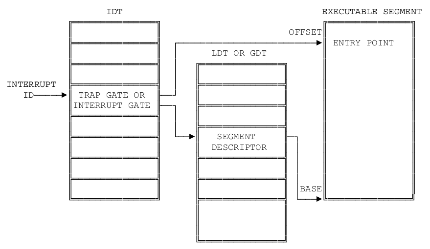
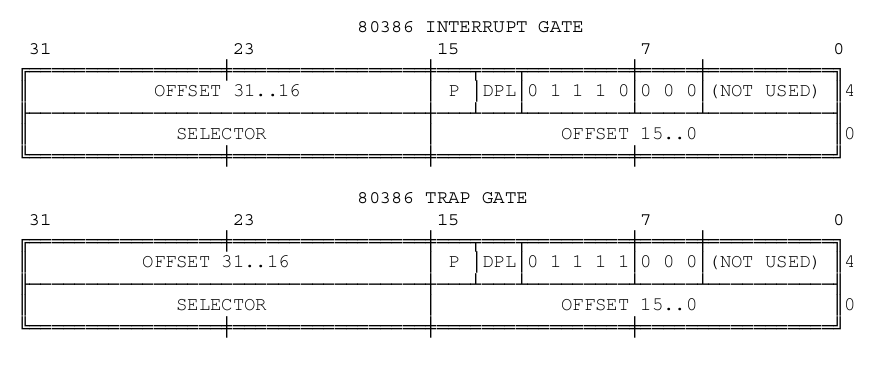
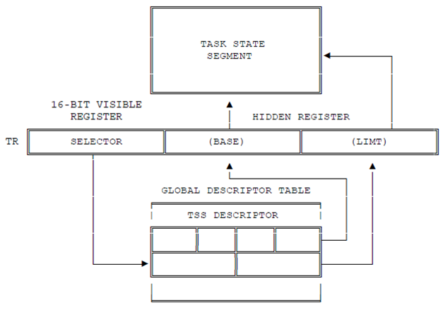
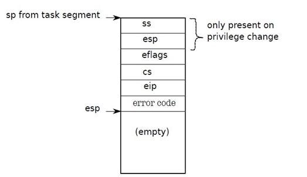
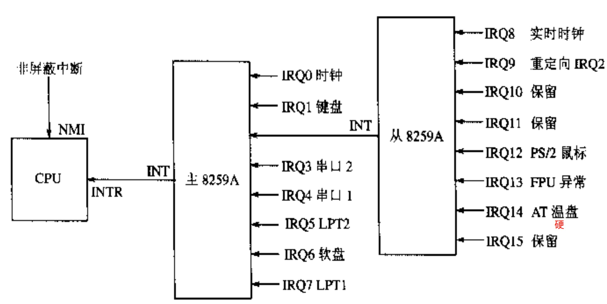

#Lab2 系统调用
-----


##目录

1. [实验要求](#toc_3)
2. [IA-32中断](#toc_7)
3. [系统调用](#toc_11)
4. [库函数](#toc_14)
5. [实验攻略](#toc_16)
6. [框架代码](#toc_23)
7. [实验报告](#toc_24)

##Lab2 系统调用

###1 实验要求

设计实现一个简单的应用程序实,并在其中调用一个自定义实现的系统调用，由此熟悉系统调用的全过程。在理解原有关键代码基础之上，在用户态和内核态分别完善系统调用的过程，并创建系统的第一个应用程序。本实验中重点在于熟悉中断与异常，堆栈的切换。

####1.1 目标
我们首先按 OS 的启动顺序来确认一下这次的工作:

1. <font color=orange>从实模式进入保护模式</font>
2. <font color=orange>加载内核到内存某地址并跳转运行</font>
3. 初始化中断向量表
4. 初始化 GDT 表
5. 配置 TSS 段
6. 从磁盘加载用户程序到内存相应地址, 并修改用户程序的各个 GDT 表项
7. 进入用户空间前的相关配置
8. 正式进入用户空间

内核程序和用户程序将分别运行在内核态以及用户态, 在 Lab1 中我们提到过保护模式除了寻址长度达到32位之外, 还能让内核有效地进行权限控制, 我们约定内核态为 ring0, 用户态为 ring3, 特权等级由段描述符的后两位确定. 也就是说, 在你的用户程序中擅自修改显存是不被允许的.

####1.2 实验内容
我们在这里明确一下具体的实验内容:

1. 内核: 建立完整的系统调用机制, 实现系统调用putc
2. 库: 基于putc系统调用实现库函数printf(格式化输出)
3. 用户: 实现一个调用print的测试程序.

实现细节可以自行设计系统调用表，也可利用中断向量表实现, 不过在讲解实验攻略前, 我们还是先来看一些资料吧.

####1.3 进阶要求
是不是觉得字符输出得不够优美, 是不是觉得屏幕上的字符显得很凌乱, 在实模式下我们可以调用中断来完成清屏和滚屏的功能, 那么你是不是也可以在保护模式下完成相应功能呢?要求: 模仿 terminal 设计一个格式化输出 `printf`.

###2 IA-32中断机制
####2.1 中断

让CPU一直监视设备的工作可不是明智的选择. 以磁盘为例, 磁盘进行一次读写需要花费大约5毫秒的时间, 但对于一个2GHz的CPU来说, 它需要花费10,000,000个周期来等待磁盘操作的完成. 因此我们迫切需要一种汇报机制: 在磁盘读写期间, CPU可以继续执行与磁盘无关的代码; 磁盘读写结束后, 主动向CPU汇报, 这时CPU才继续执行与磁盘相关的代码. 这样的汇报机制就是中断.

为了方便叙述, 我们称中断到来之前CPU正在执行的工作为A. 中断到来之后, CPU不能再执行A了, 它应该先去处理到来的中断. 因此它应该跳转到一个地方, 去执行中断处理的代码, 结束之后再恢复A的执行. 可以看到, A的执行流程被中断打断了, 为了以后能够完美地恢复到被中断打断时的状态, CPU在处理中断之前应该先把A的状态保存起来, 等到中断处理结束之后, 根据之前保存的信息把计算机恢复到A被打断之前的状态. 这样A就可以继续运行了, 在它看来, 中断就好像没有发生过一样.

接下来的问题是, 哪些内容表征了A的状态? CPU又应该将它们保存到哪里去? 在IA-32中, 首先当然是`EIP`(instruction pointer)了, 它指示了A在被打断的时候正在执行的指令; 然后就是`EFLAGS`(各种标志位)和`CS`(代码段, CPL). 由于一些特殊的原因, 这三个寄存器的内容必须由硬件来保存. 此外, 通用寄存器(GPR, general propose register)的值对A来说还是有意义的, 而进行中断处理的时候又难免会使用到寄存器. 但硬件并不负责保存它们, 因此我们还需要手动保存它们的值.

要将这些信息保存到哪里去呢? 一个合适的地方就是程序的堆栈. 中断到来时, 硬件会自动将`EFLAGS`, `CS`, `EIP`三个寄存器的值保存到堆栈上. 此外, IA-32提供了`pusha`/`popa`指令, 用于把通用寄存器的值压入/弹出堆栈, 但你需要注意压入的顺序(请查阅i386手册). 如果希望支持中断嵌套 -- 即在进行优先级低的中断处理的过程中, 响应另一个优先级高的中断 -- 那么堆栈将是保存信息的唯一选择. 如果选择把信息保存在一个固定的地方, 发生中断嵌套的时候, 第一次中断保存的状态信息将会被优先级高的中断处理过程所覆盖!

等到中断处理结束之后, CPU将会根据堆栈上保存的信息恢复A的状态, 最后执行`iret`指令. `iret`指令用于从中断返回, 它将使用栈顶的三个元素来依次恢复`EIP`, `CS`, `EFLAGS`的值. "悄悄的我走了, 正如我悄悄的来; 我用一用堆栈, 不带走一个比特."

我们在上文提到, 中断到来之后, CPU应该跳转到一个地方. 这个地方在哪里呢? 我们先上一张图给大家看看IA-32是怎么来寻找跳转目标的:



你已经见识过IA-32存储管理, 这种图已经不能吓唬你了. 从图中可以看到, 跳转的目标地址是通过门描述符(gate descriptor)来指示的. 门描述符有3种:

* 中断门(interrupt gate)
* 陷阱门(trap gate)
* 任务门(task gate)

其中任务门在实验中不会用到. 中断门和陷阱门的结构如下:



由于IA-32分段机制的存在, 我们必须通过段和段内偏移来表示跳转目标. 因此在中断门和陷阱门中, selector的位域用于指示目标段的段描述符, offset的位域用于指示跳转目标在段内的偏移. 这样, 如果能找到一个门描述符, 就可以根据门描述符中的信息计算出跳转目标了.

为了方便管理各个门描述符, IA-32在内存中开了一个数组, 叫中断描述符表(IDT, interrupt descriptor table), 数组的一个元素就是一个门描述符. 为了找到一个门描述符, 我们还需要一个索引. 这个索引一般由中断控制器发送给CPU的中断号来给出的. 最后, 为了找到IDT, IA-32中使用IDTR寄存器来存放IDT的起始地址.

现在是万事俱备, 等到中断的东风一刮, CPU就会按照我们的设定跳转到目标地址:

1. 依次将`EFLAGS`, `CS`, `EIP`寄存器的值压入堆栈
2. 从`IDTR`中读出IDT的首地址
3. 根据中断控制器给出的中断号, 在IDT中进行索引, 找到一个门描述符
4. 如果它是一个中断门描述符, 则将`EFLAGS`中的`IF`位清零, 即屏蔽外部中断
5. 把门描述符中的selector域装入`CS`寄存器
6. 根据`CS`寄存器中的段选择符, 在GDT或LDT中进行索引, 找到一个段描述符
7. 在段描述符中读出段的基地址, 和门描述符中的`offset`域相加, 得出入口地址
8. 跳转到入口地址

####2.2 异常

异常是指CPU在执行过程中检测到的不正常事件, 例如除数为零, 无效指令, 缺页等。在IA-32中, 异常和中断是统一进行处理的: CPU在异常发生的时候会生成一个异常号, 然后根据异常号在IDT中进行索引, 找到一个门描述符, 接下来的过程基本上中断处理一样。

一般来说, 中断处理会在IDT中找到中断门描述符, 异常处理会在IDT中找到陷阱门描述符. 它们的唯一区别就是, 穿过中断门的时候, `EFLAGS`中的`IF`位将会被清零, 达到屏蔽其它外部中断的目的; 而穿过陷阱门的时候, `IF`位将保持不变。i386手册中记录了系统对中断号和异常号的分配情况, 并列出了各种异常的详细解释, 需要的时候你随时可以进行查阅。

####2.3 TSS

最后我们还要解释硬件是如何找到新堆栈的, IA-32借助TR和TSS来完成这一过程. TR(Task state segment Register)是任务状态段寄存器, 它是一个16位的寄存器, 结构和CS, DS, SS这些段寄存器完全一样, 它存放了GDT或IDT的一个索引, 通过TR可以在GDT或IDT中找到一个TSS段描述符, 索引的过程如下:



TSS(Task State Segment)是任务状态段, 其结构如下图所示. 它和代码段, 数据段不同, 是一个有特殊作用的段. TSS用于存放任务的状态(现场)信息, 主要用在硬件上下文切换. TSS还提供了3个堆栈位置(包括`SS`和`ESP`), 当发生堆栈切换的时候, CPU将根据目标代码特权级的不同, 从TSS中取出相应的堆栈位置信息进行切换, 例如我们的中断处理程序位于ring0, 因此CPU会从TSS中取出`SS0`和`ESP0`进行切换. 为了让硬件在进行堆栈切换的时候可以找到新堆栈, 内 核需要将新堆栈的位置写入TSS的相应位置. TSS中的其它内容主要在硬件上下文切换中使用, 但是Nanos和大多数现代操作系统都不使用硬件上下文切换(因为效率的问题), 因此TSS中的大部分内容都不会使用。


<div style="background-color:lightblue;padding:4px;border-top:1px solid grey;border-left:1px solid grey;border-right:1px solid grey;"><b>ring3的堆栈在哪里?</b></div>
<div style="border:1px solid grey;padding:10px;">
IA-32提供了4个特权级, 但TSS中只有3个堆栈位置信息, 分别用于ring0, ring1, ring2的堆栈切换.为什么TSS中没有ring3的堆栈信息?
</div>

加入硬件堆栈切换之后, 中断到来/从中断返回的硬件行为如下:

	old_CS = CS
	old_EIP = EIP
	old_SS = SS
	old_ESP = ESP
	target_CS = IDT[vec].selector
	target_CPL = GDT[target_CS].DPL
	if(target_CPL < GDT[old_CS].DPL)
		TSS_base = GDT[TR].base
		switch(target_CPL)
			case 0: 
				SS = TSS_base->SS0
				EPS = TSS_base->ESP0
			case 1: 
				SS = TSS_base->SS1
				EPS = TSS_base->ESP1
			case 2: 
				SS = TSS_base->SS2
		EPS = TSS_base->ESP2
		push old_SS
		push old_ESP
	push EFLAGS
	push old_CS
	push old_EIP
	
	################### iret ####################
	
	old_CS = CS
	pop EIP
	pop CS
	pop EFLAGS
	if(GDT[old_CS].DPL < GDT[CS].DPL)
		pop ESP
		pop SS
		
硬件堆栈切换只会在目标代码特权级比当前堆栈特权级高的时候发生, 即`GDT[target_CS].DPL < GDT[SS].DPL`(这里的小于是数值上的). 当`GDT[target_CS].DPL = GDT[SS].DPL`时, CPU将不会进行硬件堆栈切换, 我们之前编写内核时的中断处理都属于这种情况。

###3 系统调用

####3.1 系统调用指令过程

首先系统调用的入口在lib下的`syscall.c`，在`syscall`函数里可以使用嵌入式汇编，先将各个参数分别赋值给`eax,ebx,ecx,edx,edi,esi`，然后约定将返回值放入eax中（把返回值放入eax的过程是我们需要在内核中实现的），接着使用`int`指令陷入内核。

	asm volatile("int $0x80": "=a"(ret) : "a"(args[0]), "b"(args[1]), "c"(args[2]), "d"(args[3]));

剩下的部分中断、异常、陷阱、系统调用都一样，因此下文中除非特殊说明，“中断”一词代表着中断、异常、陷阱、系统调用这4个概念，但唯独中断号和系统调用号进行区分，中断号是指idt表中的索引，系统调用号是指不同的系统调用函数的标识符。

int指令是一个较为复杂的指令，其做了很多事情，按顺序包括以下几步：

1. 查找```idtr```里面的```idt```地址，根据这个地址找到```idt```，然后根据```idt```找到中断向量的表项。
2. 检查```cpl```和表项的```dpl```，如果```cpl>dpl```产生保护异常，否则继续
3. 根据```tssr```寄存器里的```tss```地址找到```tss```在内存中的位置，读取其中的```ss```和```esp```并装载（```tss```结构是x86定义好的，其内存中存放的位置需要os去决定，并对其中内容的赋值也要os 实现）。
4. 如果是一个用户态到内核态的陷入操作，则像堆栈中压入```ss```和````esp```，注意这个```ss```和```esp```是之前用户态的数据，而不是新装载的数据
5. 压入```esp```,```eflags```,```eip```
6. 修改```eflags```中的某些位（比如关中断）
7. 如果有必要，压入```errorcode```，某些中断需要```errorcode```以及不同中断的```errorcode```含义可查看```handout```。
8. 根据```idt```表项设置`cs`和`eip`，也就是跳转到处理函数执行。



压入后的堆栈就应该是这个样子的，跳转到相应中断处理函数的时候我们面对的就是这样一个堆栈。接着中断处理函数处理相应操作，然后根据目前堆栈里有的内容和当前寄存器的内容恢复现场，继续程序执行。

<div style="background-color:lightblue;padding:4px;border-top:1px solid grey;border-left:1px solid grey;border-right:1px solid grey;"><b>Iret指令</b></div>
<div style="border:1px solid grey;padding:10px;">
IA-32指令手册关于这一点描述的很清楚,原文如下：
<p>the IRET instruction pops the return instruction pointer, return code segment selector,
and EFLAGS image from the stack to the EIP, CS, and EFLAGS registers, respectively, and then resumes execution of the interrupted program or procedure. If the return is to another privilege level, the IRET instruction also pops the stack pointer and SS from the stack, before resuming program execution.</p>
</div>

<div style="margin-top:20px;background-color:lightblue;padding:4px;border-top:1px solid grey;border-left:1px solid grey;border-right:1px solid grey;"><b>保存寄存器的旧值</b></div>
<div style="border:1px solid grey;padding:10px;">
我们在内联汇编中"野蛮"地往寄存器里面填入系统调用的参数, 这样会导致这些寄存器的旧值被冲刷, 万一从内核返回之后仍然需要使用某些寄存器的旧值, 将会产生不可恢复的错误. 我们是否应该在填入参数之前把寄存器的旧值保存起来?
</div>

####3.2 系统调用接口

有了`syscall()`接口函数, 我们就可以很方便地编写系统调用了, 例如将来的`write()`函数可以这样实现:

	int write(int fd, char* buf, int length) {
		return syscall(SYS_write, fd, buf, length);
	}

在本学期的实验中, 所有系统调用的参数个数不会超过4个(已包含系统调用号), 因此在内联汇编中只需要传递4个参数就足够了.

`syscall()`接口函数只是提供给用户进程来陷入内核的, 另一方面, 我们需要在内核实现这些系统调用的具体功能. 内核得知用户进程通过`int $0x80`陷入后, 会调用`asm_do_irq`, 它会根据用户进程传进来的系统调用号执行相应的操作.

和中断到来一样, 用户进程的所有现场信息都已经保存在`TrapFrame`中了, 内核很容易获取它们. 系统调用分发函数`asm_do_irq`并不负责处理系统调用, 相反, 它只负责给相应的服务器发送消息, 请求它们来处理系统调用, 并等待服务器的回复。系统调用处理结束后, 等到内核通过`iret`返回到用户进程的时候, 用户进程可以通过`eax`寄存器获得系统调用的返回值, 进而得知系统调用执行的结果(例如是否成功等)。

###4 库函数

####4.1 实现printf

从功能上来讲, `printk`与`printf`并没有任何区别, 它们的作用都是格式化输出, 唯一的区别是: `printk`工作在内核空间, `printf`工作在用户空间. `printf`可以接收不固定数目的参数(但至少要有一个), 根据calling convention, `gcc`会把这些参数从右到左压入堆栈。
 　　　
<div style="background-color:lightblue;padding:4px;border-top:1px solid grey;border-left:1px solid grey;border-right:1px solid grey;"><b>手工实现printf</b></div>
<div style="border:1px solid grey;padding:10px;">
你的任务是要实现printf, 让其具有格式化字符串的功能, 并将结果输出到串口.<br>
为了方便使用, 你需要实现<code>%d</code>, <code>%x</code>, <code>%s</code>,<code>%c</code>四种格式转换说明符, 如果你不清楚它们的含义, 请查阅相关资料.
<p>我们为大家准备了<code>printf</code>的测试代码:</p>
<pre>
printf("printf test begin...\n");
printf("the answer should be:\n");
printf("#######################################################\n");
printf("Hello, welcome to OSlab! I'm the body of the game. ");
printf("Bootblock loads me to the memory position of 0x100000, and Makefile also tells me that I'm at the location of 0x100000. ");
printf("~!@#$^&*()_+`1234567890-=...... ");
printf("Now I will test your printf: ");
printf("1 + 1 = 2, 123 * 456 = 56088\n0, -1, -2147483648, -1412505855, -32768, 102030\n0, ffffffff, 80000000, abcdef01, ffff8000, 18e8e\n");
printf("#######################################################\n");
printf("your answer:\n");
printf("=======================================================\n");
printf("%s %s%scome %co%s", "Hello,", "", "wel", 't', " ");
printf("%c%c%c%c%c! ", 'O', 'S', 'l', 'a', 'b');
printf("I'm the %s of %s. %s 0x%x, %s 0x%x. ", "body", "the game", "Bootblock loads me to the memory position of", 0x100000, "and Makefile also tells me that I'm at the location of", 0x100000);
printf("~!@#$^&*()_+`1234567890-=...... ");
printf("Now I will test your printf: ");
printf("%d + %d = %d, %d * %d = %d\n", 1, 1, 1 + 1, 123, 456, 123 * 456);
printf("%d, %d, %d, %d, %d, %d\n", 0, 0xffffffff, 0x80000000, 0xabcedf01, -32768, 102030);
printf("%x, %x, %x, %x, %x, %x\n", 0, 0xffffffff, 0x80000000, 0xabcedf01, -32768, 102030);
printf("=======================================================\n");
printf("Test end!!! Good luck!!!\n");
</pre>
</div>

实现了`printf`后, 你可以使用它帮助你调试代码: 它可以在应用程序中输出变量的值。

###5 实验攻略

####5.1 初始化 GDT 表项和 TSS 段

我们在 Lab1 中使用了三个表项的 GDT 表, 它们分别是

* 代码段
* 数据段
* 视频段

在 Lab2 的框架代码里, 我们为你准备了5个 GDT 表项:

* 核心态代码段
* 核心态数据段
* 用户态代码段
* 用户态数据段
* TSS 段

如果有需要, 你们可以向 GDT 里添加视频段以便于字符串输出. 核心段和用户段由于特权等级不同而赋予 DPL 的值也不同, 核心段的特权等级为0, 而用户段的特权等级为3. TSS 段用于任务切换, 如资料中所讲, 我们只需要关注其中的 `ss0` 和 `esp0` 两个值. 在发生任务切换, 也就是用户态进入核心态时, TSS 将保存用户程序的现场信息, 而取出 ring0 下的 ss 和 esp 值, 继而工作在核心态. 初始化完 TSS 后不要忘记用`lr` 指令加载 TSS 段.

####5.2 初始化中断描述符表 IDT

IDT 表的初始化工作在 `idt.c` 文件下, 我们已经为你准备了中断门和陷阱门的初始化函数, 为了防止系统的异常终止, 我们为每个中断号都准备了处理函数, 同时也给出了两个测试用的例子. 除此之外, 你还需要为一些异常设置中断处理.


| 向量号 | 助记符 | 描述 | 类型| 有无出错码| 源|
| :---:|:----:|:----:|:----:|:----:| :----:|
| 0| #DE   | 除法错    | Fault    | 无    | DIV 和 IDIV 指令 |
| 1| #DB   | 调试异常 | Fault/Trap    | 无    | 任何代码和数据的访问 |
| 2| --   |非屏蔽中断| Interrupt    | 无    |非屏蔽外部中断 |
| 3| #BP   |调试断点    | Trap    | 无    |指令 INT 3 |
| 4| #OF   | 溢出    | Trap    | 无    | 指令 INTO |
| 5| #BR   |越界    | Fault    | 无    | 指令 BOUND |
| 6| #UD   | 无效(未定义)操作码 | Fault    | 无    | 指令 UD2 或者无效指令 |
| 7| #NM   | 设备不可用(无数学协处理器)    | Fault    | 无    |浮点指令或 WAIT/FWAIT 指令 |
| 8| #DF   | 双重错误    | Abort    | 有(或零)    |所有能产生异常或 NMI 或 INTR 的指令 |
| 9|    | 协处理器段越界    | Fault    | 无    | 浮点指令(386之后的 IA32 处理器不再产生此种异常) |
| 10| #TS   | 无效TSS    | Fault    |有    | 任务切换或访问 TSS 时 |
| 11| #NP   | 段不存在    | Fault    | 有    | 加载段寄存器或访问系统段时 |
| 12| #SS   | 堆栈段错误    | Fault    | 有    | 堆栈操作或加载 SS 时 |
| 13| #GP   | 常规保护错误    | Fault    | 有    | 内存或其他保护检验 |
| 14| #PF   | 页错误    | Fault    | 有    | 内存访问 |
| 15| --   | Intel 保留, 未使用    |     |  | |
| 16| #MF   | x87FPU浮点错(数字错)    | Fault    | 无    |x87FPU 浮点指令或 WAIT/FWAIT 指令|
| 17| #AC   | 对齐检验    | Fault    | 有(ZERO)    | 内存中的数据访问(486开始)|
| 18| #MC   | Machine Check    | Abort    | 无    | 错误码(如果有的话)和源依赖于具体模式(奔腾 CPU 开始支持) |
| 19| #XF   | SIMD浮点异常   | Fault    | 无    | SSE 和 SSE2浮点指令(奔腾 III 开始) |
| 20-31| --   |Intel 保留, 未使用    ||||
| 32-255| --   | 用户定义中断    | Interrupt    |     |外部中断或 int n 指令|

以上所列的异常中包括 Fault/Trap/Abort 三种, 当然你也可以称之为错误, 陷阱和终止

* <b>Fault</b>: 一种可被更正的异常, 一旦被更正, 程序可以不失连续性地继续执行, 中断程序返回地址为产生 Fault 的指令
* <b>Trap</b>: 发生 Trap 的指令执行之后立刻被报告的异常, 也允许程序不失连续性地继续执行, 但中断程序返回地址是产生 Trap 之后的那条指令
* <b>Abort</b>: Abort 异常不总是精确报告发生异常的位置, 它不允许程序继续执行, 而是用来报告严重错误.

对照这张表, 你就可以为相应的异常设置中断处理程序了, 当然有些异常并不需要处理, 比如14号中断因为我们并没有开启分页, 所以无需为它设置中断处理程序

####5.3 初始化 8259 中断控制器

上面我们讲了异常的处理, 接下里要讲的是中断, 中断产生的原因可以分为两种, 一种是外部中断, 即由硬件产生的中断, 另一种就是有指令 `int n`产生的中断, `int`中断我们在资料中已经有过详细的说明, 下面要讲的是外部中断.

外部中断分别不可屏蔽中断(NMI) 和可屏蔽中断两种, 分别由 CPU 得两根引脚 NMI 和 INTR 来接收, 如图所示



NMI 不可屏蔽, 它与标志寄存器的 IF 没有关系, NMI 的中断向量号为 2 , 在上面的表中已经有所说明. 而可屏蔽中断与 CPU 的关系是通过可编程中断控制器 8259A 建立起来的. 那如何让这些设备发出的中断请求和中断向量对于起来呢? 在 BIOS 初始化 8259A 的时候, IRQ0-IRQ7被设置为对应的向量号`0x08`-`0x0F`, 但是我们发现在保护模式下, 这些向量号已经被占用了, 因此我们不得不重新设置主从8259A(两片级联的8259A).

设置的细节你不需要详细了解, 你只需要知道我们将外部中断重新设置到了`0x20`-`0x2F`号中断上, 因此, 你定义的中断号应该从`0x30`开始. 此外, 由于我们没有为外部中断设置中短程处理函数, 你可能会在实验中遇到 IRQ14 号中断, 解决方案留给你们.

####5.4 加载用户程序

我们在框架代码中将内核填充到了200个扇区的大小, 也就是说, 用户程序将存放在磁盘的第202个扇区的位置, 因此, 你需要从202个扇区的用户程序加载到内存的相应位置, 这部分内容同 Lab1 的加载内核代码, 需要注意的是这里不能直接跳转用户程序运行, 这里的跳转需要有特权级的转换. 还需要根据我们读取的用户代码来重新设置 GDT 表中的用户段内容.

####5.5 跳转到用户空间

我们知道内核程序应该运行在内核态, 而用户程序应该运行在用户态, 他们的特权等级是不同的, 举个例子, 内核程序可以通过视频段访问修改显存, 但是用户程序不可以, 而且用户程序只允许修改自己的数据段以及堆栈, 而不允许对其他程序的代码, 数据, 堆栈的修改. 因此, 你首先需要为用户程序设置正确的数据段寄存器DS.

<div style="background-color:lightblue;padding:4px;border-top:1px solid grey;border-left:1px solid grey;border-right:1px solid grey;"><b>注意</b></div>
<div style="border:1px solid grey;padding:10px;">
如果你在 GDT 中初始化了视频段寄存器, 你需要将其 DPL 设置为0以保证用户程序无法通过视频段寄存器修改显存.
</div>

为了能够实现特权级转换的跳转, 我们使用 `iret` 指令, 在资料中我们也详细说明了该指令具体做了什么事, 由于操作系统首先是运行在内核态的, 所以我们需要手动为 `iret`做准备:

* SS 入栈
* ESP 入栈
* EFLAGS 入栈
* CS 入栈
* EIP 入栈
* IRET

这里我们所提到的各个段寄存器就应该是用户态下的段寄存器了, 我们应该在之前重新初始化过一次 GDT 表, 而在跳转之前需要对 GDT 表项里的用户段做出修改, 以保证我们是真的进入了 ring3用户态.

####5.6 库函数

我们在 lib 文件夹里为你准备了 `syscall.c` 文件以作为系统调用的入口, 当然你也可以选择自行设计入口函数. 格式化输出函数 `printf`为必完成内容, 测试代码也在上面列出, 你可以选择输出到串口, 但是必须也要能够输出到屏幕上.

###6 框架代码

我们为Lab2准备了框架代码, 代码结构如下:

	+Lab2
	|---+bootloader				#你的引导程序
	|   |---...				
	|---+utils
	|   |---genboot.pl			#生成引导程序
	|   |---genkernel.pl		#生成内核程序
	|---+kernel
	|   |---+include			#头文件
	|   |---+kernel				#内核代码
	|   |   |---do_irq.S		#中断处理
	|   |   |---i8259.c			#重设主从8259A
	|   |   |---idt.c			#初始化中断描述表
	|   |   |---irq_handle.c	#中断处理函数
	|   |   |---kvm.c			#初始化 GDT 和加载用户程序
	|   |   |---serial.c		#初始化串口输出
	|   |---+lib				
	|   |---main.c				#主函数
	|   |---Makefile				
	|---+app					#用户代码
	|   |---main.c				#主函数
	|   |---Makefile	
	|---+lib					#库函数
	|   |---lib.h
	|   |---types.h
	|   |---syscall.c			#系统调用入口
	|---Makefile
	
由于你们已经完成了引导程序, 所以我们就不再提供引导程序的代码, 而使用你们自己的引导程序, 需要注意的是, 有部分同学在 Lab1中使用了图形模式, 在 Lab2中你也可以继续使用, 不过你可能需要做更多的工作.

###7 报告内容

####7.1 实验报告( 截止日期: 2016/4/5 23:59:59)

内容同 Lab1